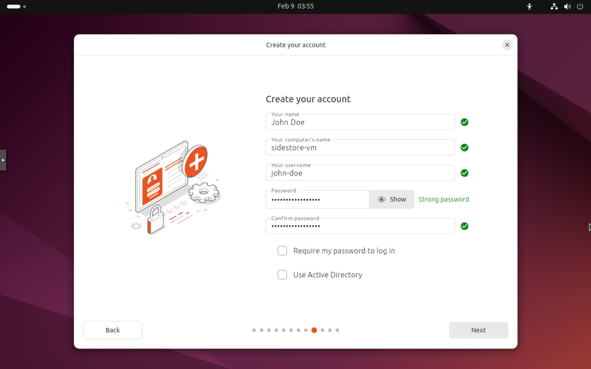
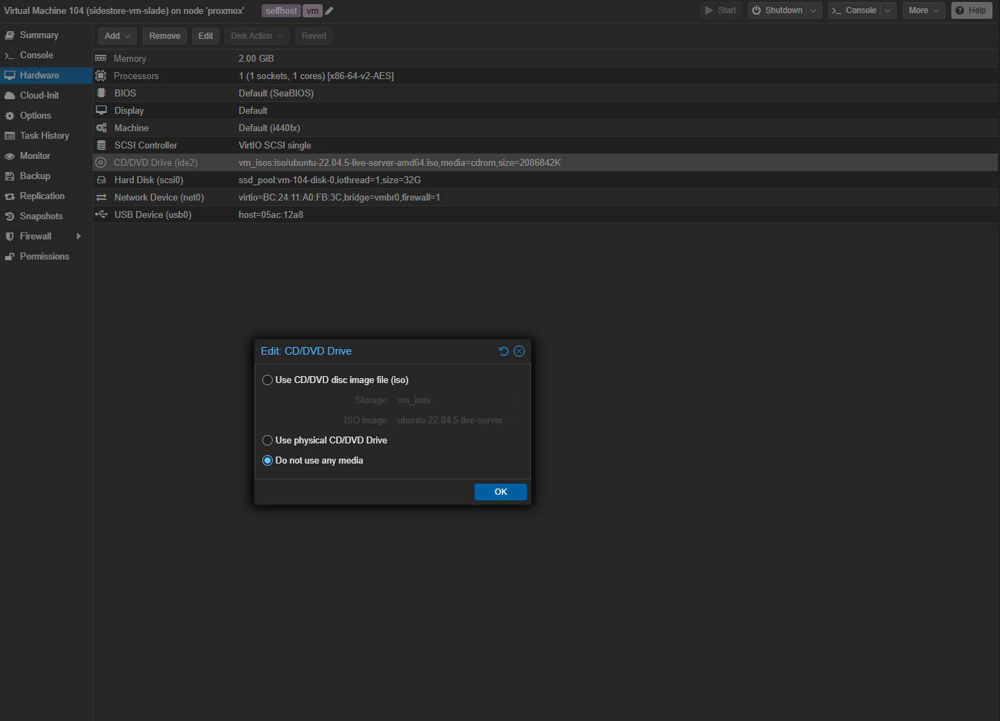
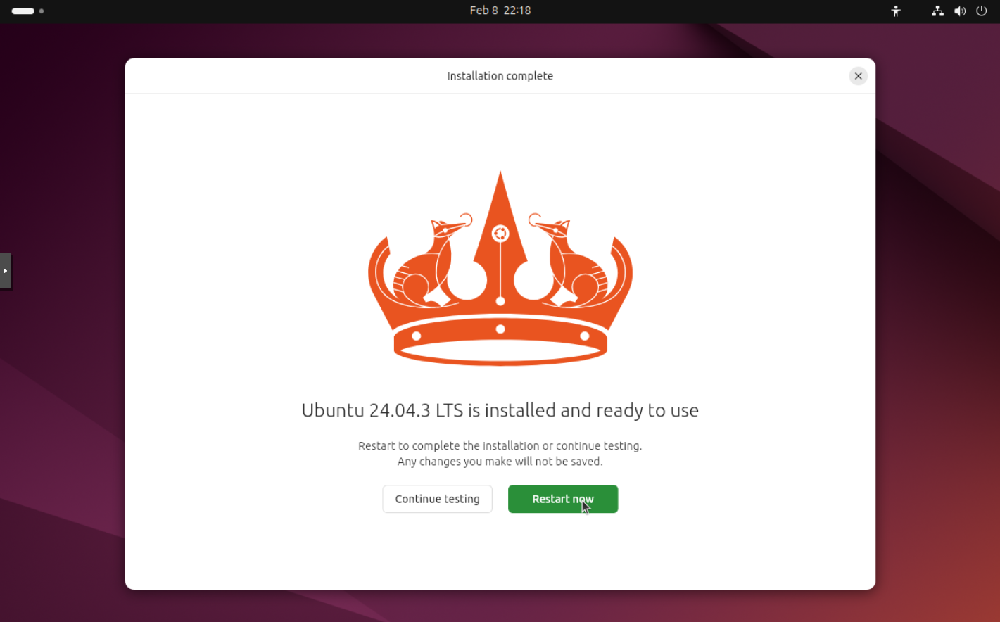
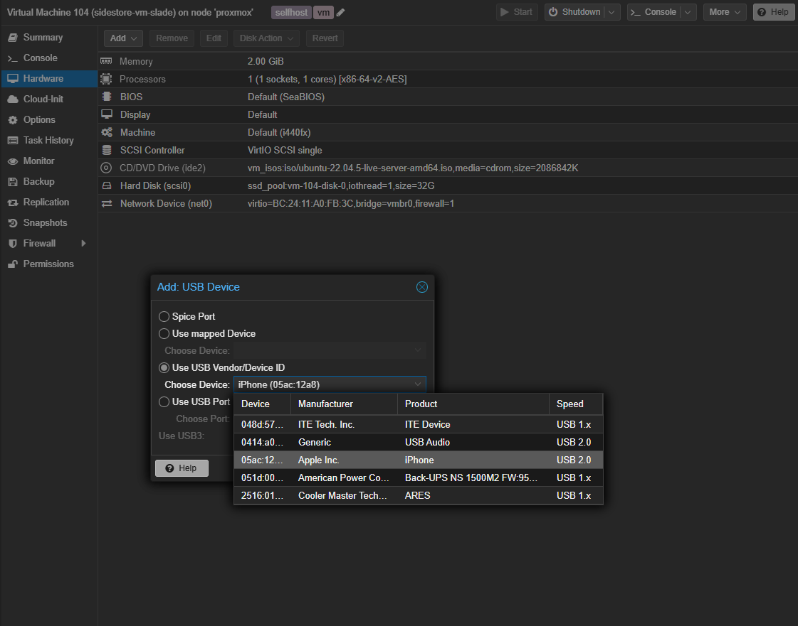

# SideStore Installation Guide

SideStore is a sideloading tool that allows you to install apps on your iOS device without requiring a jailbreak. This guide walks you through setting up a dedicated VM to sideload SideStore onto your device using iloader.

> **Note:** These instructions are tailored to Proxmox, but can be used on other hypervisors or bare metal systems.

## Table of Contents

- [Prerequisites](#prerequisites)
- [Create VM](#create-vm-ubuntu-24043-desktop-lts)
- [Pass Through the USB Device](#pass-through-the-usb-device)
- [Setup iloader](#setup-iloader)
- [Setup SideStore](#setup-sidestore)
- [Automation Shortcut](#automation-shortcut)
- [Troubleshooting](#troubleshooting)

## Prerequisites

- A Proxmox host (or another hypervisor / bare metal system)
- An Apple iOS device connected via USB cable
- An Apple ID
- Ubuntu 24.04.3 Desktop LTS ISO

## Create VM (Ubuntu 24.04.3 Desktop LTS)

### Hardware Requirements:

- **OS:** Ubuntu 24.04.3 Desktop LTS
- **CPU:** 4 cores
- **RAM:** 4GB (4096MB)
- **Storage:** 32GB

### Install Ubuntu:

- Next your way through the install until you get to the user creation screen.
- Create your user.
    

### Remove install media:

- Hardware
- CD/DVD Drive
- Edit
- Do not use any media
    
- Reboot your VM.
    
- Once you have rebooted, update & upgrade your machine.
    ```bash
    sudo apt update && sudo apt upgrade -y
    ```
- Install USB utilities (required for USB passthrough):
    ```bash
    sudo apt install -y usbutils
    ```

## Pass through the USB device

### Select the VM ID you created from the left hand menu and do the following:

- Select Hardware
- Add
- USB Device
- Use USB Vendor/Device ID
- Select the 'Apple Inc' manufacturer.
- Then reboot machine.
    

## Setup iloader

[iloader](https://github.com/nab138/iloader) is a tool used to sideload SideStore onto your iOS device from a Linux machine.

### Optional: Use SSH for the install

```bash
sudo apt install -y openssh-server
sudo systemctl enable --now ssh
```

From a separate machine:
```bash
ssh username@ip_address
```

### Download iloader:

```bash
wget -O /tmp/iloader-linux-amd64.deb https://github.com/nab138/iloader/releases/latest/download/iloader-linux-amd64.deb
```

### Install:

```bash
sudo apt install -y /tmp/iloader-linux-amd64.deb
```

### iloader Setup:

- Login with your Apple ID.
- Refresh the iDevices and select your device (if not already selected).
- Click the 'SideStore (Stable)' installer.

## Setup SideStore

1. Install [LocalDevVPN](https://apps.apple.com/us/app/localdevvpn/id6755608044) from the App Store. This creates a local VPN connection that SideStore needs to communicate with itself for refreshing apps.
2. Open the Settings app.
3. Navigate to 'General', and then 'VPN & Device Management'.
4. Under the "Developer App" section, select the option named after your Apple Account.
5. Select "Trust [Apple Account name]", then select "Allow & Restart".
6. Enter your passcode to confirm you want to trust the app.
7. Navigate to 'Privacy and Security'.
8. Scroll to the bottom, and turn on "Developer Mode". Your device will restart.
9. Open LocalDevVPN and select 'Connect'.
10. Open SideStore.
11. Sign in to the Apple Account you used with iloader.

## Automation Shortcut

> **Important:** Without this automation, your app certificates will expire in 7 days and you will need to repeat the iloader sideloading process to restore them. Setting this up ensures your apps stay signed automatically.

- Open the [SideStore Refresher Shortcut](https://browse.shortcuty.app/shortcut/fab3e25d-3588-4ee6-b099-c1a99b74eef1) on your iOS device.
- Scan the QR code or hit the 'Get Shortcut' button.
- You will need to replace the 'Unknown Action' with 'Refresh All Apps' from SideStore.
- Next, go to the Automation tab in Shortcuts and add a new automation.
- Select Time of Day and set it to a time you will not be using your phone.
- Select the 'SideStore Refresher' shortcut and now it will refresh your apps every day at the time you set.

## Troubleshooting

### Device not detected after USB passthrough
- Verify the USB cable supports data transfer (not charge-only).
- Run `lsusb` inside the VM to confirm the device is visible.
- Try disconnecting and reconnecting the device, then check Proxmox USB passthrough settings.

### Certificates expired / apps no longer open
- If you missed the automation setup or it failed to run, you will need to reconnect your device to the VM and repeat the [iloader setup](#setup-iloader) steps to re-sideload SideStore.
- Once restored, make sure the [Automation Shortcut](#automation-shortcut) is configured correctly.

### iloader does not detect the device
- Ensure `usbutils` is installed: `sudo apt install -y usbutils`
- Confirm the device is unlocked and you have tapped "Trust" on the trust prompt on your iOS device.

### "Install SideStore" is prohibited
- Ensure you do not have App Store installs disabled. Check the following:
    - Settings → Screen Time → Content & Privacy Restrictions → iTunes & App Store Purchases → Installing Apps
- Confirm this is not set to "Don't Allow".